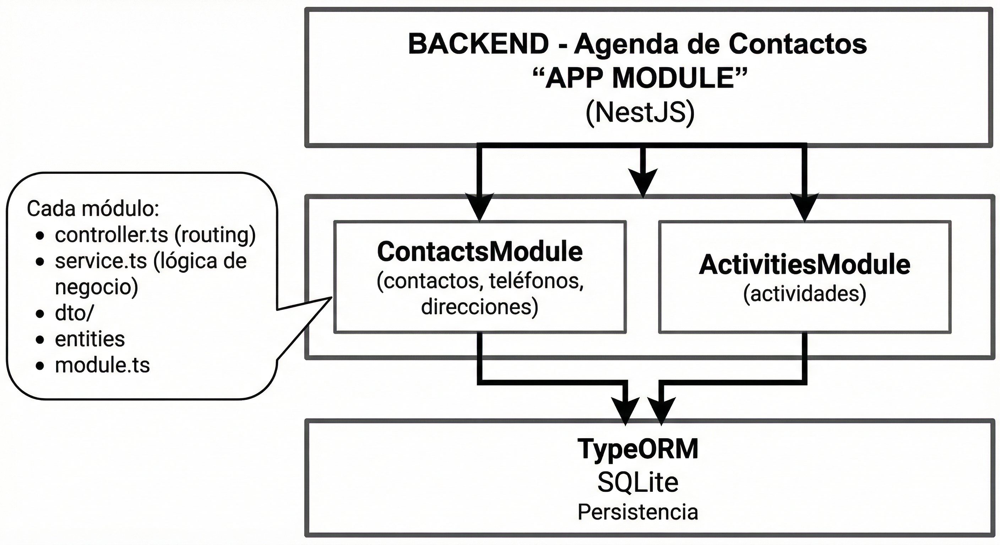
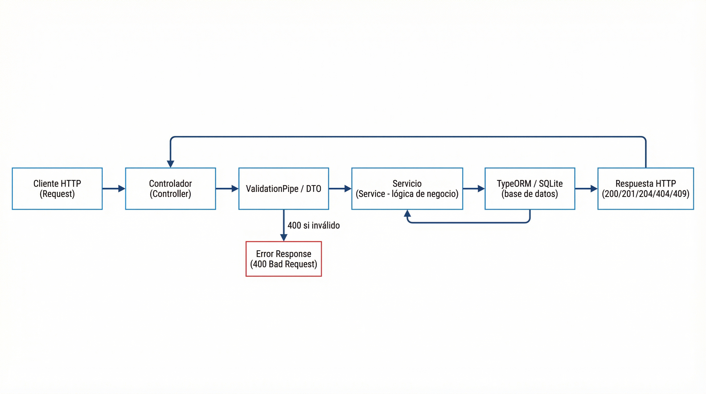

# Arquitectura del backend

Descripción de la arquitectura de la API de agenda de contactos. Las decisiones de diseño (tecnologías, patrones) se documentan en [ADR (Architecture Decision Records)](adr/README.md).

## Capas

1. **API (Controladores)**  
   Expone endpoints REST. Recibe peticiones HTTP, delega en servicios y devuelve respuestas (JSON y códigos de estado). Usa DTOs para validar entrada (ValidationPipe + class-validator).

2. **Servicios**  
   Lógica de negocio: creación y búsqueda de contactos, validación de tipos de teléfono, creación y búsqueda de actividades. No conocen HTTP; reciben y devuelven datos tipados.

3. **Persistencia (TypeORM)**  
   Acceso a SQLite mediante entidades y repositorios. Los servicios inyectan repositorios de TypeORM; no hay capa de repositorio propia adicional.

## Módulos

- **ContactsModule**: Contactos (Person), teléfonos (Phone), tipos de teléfono (PhoneType), direcciones (Address). Endpoints: crear, buscar por email, por datos personales, por número y tipo de teléfono, obtener por id, editar, eliminar.
- **ActivitiesModule**: Actividades (ContactActivity). Endpoints: crear actividad, buscar por contacto y tipo (call, meeting, email).
- **AppModule**: Orquestación global, configuración de TypeORM (SQLite), ValidationPipe y Swagger.

## Flujo de una petición

1. Cliente HTTP → Controlador (ruta y método).
2. Controlador valida entrada con DTO (ValidationPipe) → 400 si inválido.
3. Controlador llama al servicio con datos ya validados.
4. Servicio aplica reglas de negocio y usa repositorios TypeORM para leer/escribir.
5. Servicio devuelve resultado o lanza excepción (NotFoundException, ConflictException, BadRequestException).
6. Controlador devuelve respuesta HTTP (200/201/204/400/404/409).

## Decisiones arquitectónicas

Para el detalle de las decisiones (por qué NestJS, TypeORM, SQLite, Swagger, etc.), ver [docs/adr/](adr/README.md).

---

[README principal](../README.md)
