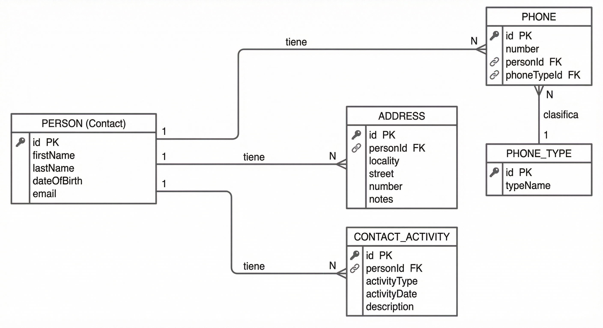
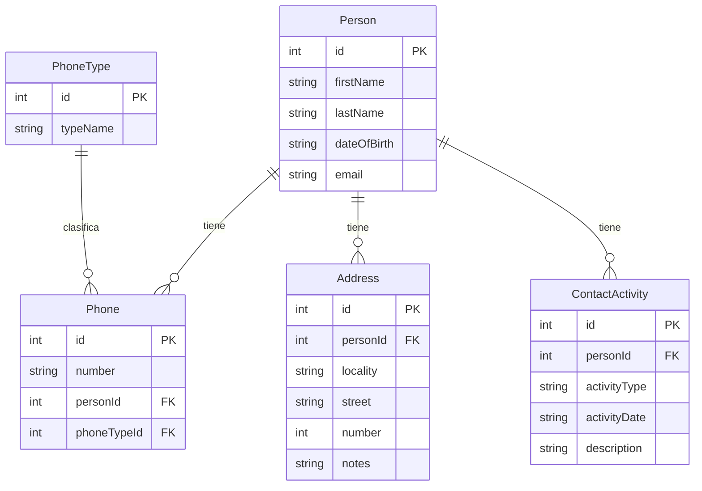

# Diagrama de base de datos

Modelo entidad-relación de la API de agenda de contactos. Implementado con TypeORM sobre SQLite.

## Esquema completo

Incluye las tablas del objetivo del challenge más la tabla **ContactActivities** para el registro de actividades (llamadas, reuniones, emails) por contacto.

## Relaciones

| Entidad          | Relación   | Entidad          | Descripción                                      |
|------------------|------------|------------------|--------------------------------------------------|
| Person           | 1:N        | Phone            | Un contacto puede tener varios teléfonos.       |
| Person           | 1:N        | Address          | Un contacto puede tener varias direcciones.      |
| Person           | 1:N        | ContactActivity  | Un contacto puede tener muchas actividades.      |
| PhoneType        | 1:N        | Phone            | Cada teléfono tiene un tipo (móvil, casa, trabajo). |

## Tabla ContactActivities

- **activityType**: Valores permitidos `'call'`, `'meeting'`, `'email'`.
- **activityDate**: Fecha y hora de la actividad (TEXT, p. ej. ISO 8601).
- **description**: Opcional.

---

[README principal](../README.md)
