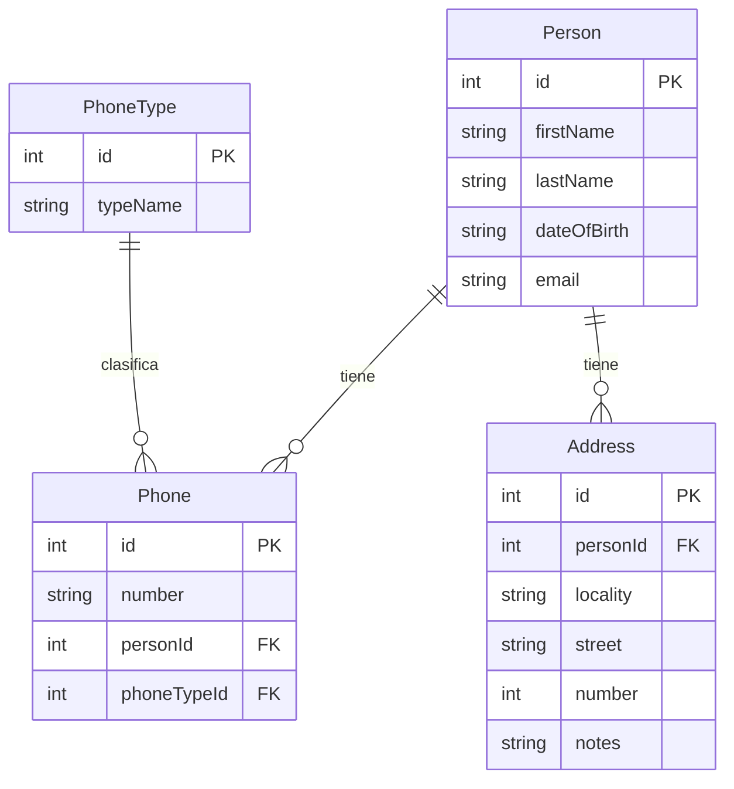

# Backend Challenge

Se necesita crear una API RESTful para una **agenda de contactos**.  
Donde cada contacto de la agenda puede tener varios **teléfonos** asociados y varias **direcciones**.

El siguiente esquema es el modelo entidad–relación de la base de datos.

> **Nota:**  
> Al esquema anteriormente mencionado, debe agregarse la tabla **ContactActivities**,  
> la cual registra las diversas actividades realizadas por o sobre los contactos,  
> como llamadas, reuniones o emails enviados.

## Tabla: ContactActivities

Debe contar con las siguientes columnas:

- **id**: Identificador único de la actividad (Primary Key).
- **personId**: Foreign key referenciando la tabla `Person` (`id`).
- **activityType**:  
  Tipo de actividad realizada  
  - Tipo: `VARCHAR`
  - No nulo  
  - Valores permitidos: `'call'`, `'meeting'`, `'email'`
- **activityDate**:  
  Fecha y hora en que se realizó la actividad  
  - Tipo: `TEXT`
  - No nulo
- **description**:  
  Descripción de la actividad  
  - Tipo: `TEXT`
  - Opcional

La solución debe construirse en:

- **Node.js** con **TypeScript**
- **SQLite** como base de datos
- **Git** como gestor de versiones
- Subida a un servicio de alojamiento gratuito como **GitHub** o **GitLab**

---

## Operaciones requeridas

La API debe permitir:

- Creación de un contacto.
- Búsqueda de contacto por email.
- Búsqueda de contactos por datos personales.
- Búsqueda de contacto por número y tipo de teléfono.
- Edición de los datos personales de un contacto.
- Eliminación de un contacto.
- Creación de una actividad.
- Búsqueda de actividades por contacto y tipo de actividad específico, retornando:
  - Nombre
  - Apellido
  - Email
  - Fecha de nacimiento

Es importante el **buen uso de los verbos HTTP** y las **respuestas correctas de los status codes**.

---

## Especificidades técnicas

- Realizarlo con **Node.js** (se pueden utilizar frameworks).
- **SQLite** como motor de base de datos.
- Todo el código debe estar **completamente escrito en TypeScript** y correctamente tipado.
- Uso correcto de los **verbos HTTP** y **status codes**.

---

## Plus

- Documentación de la API (por ejemplo con **Swagger**).
- Tests unitarios con **Jest** o similar.
- Configuración de un **linter** para controlar la estandarización del código.

---

## Criterios de evaluación

Se evaluará:

- Escritura de **código limpio** y buenas prácticas.
- **Arquitectura**.
- **Patrones de diseño**.
